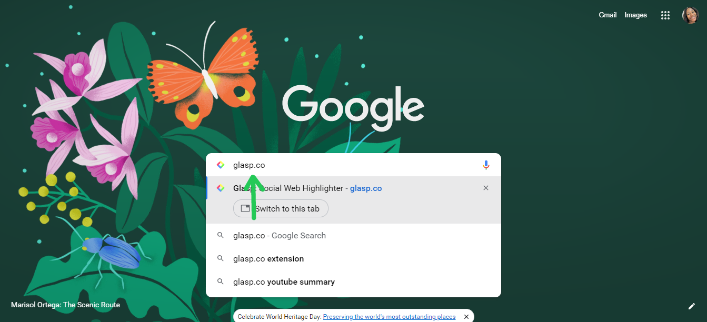
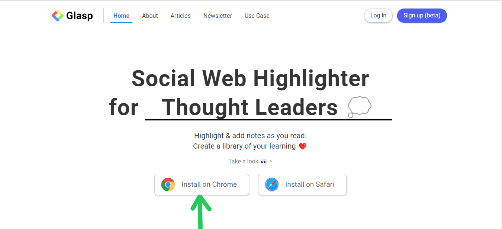
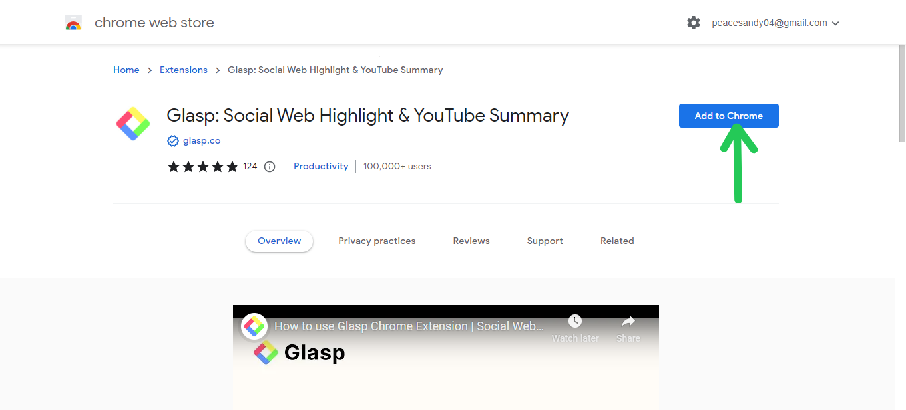
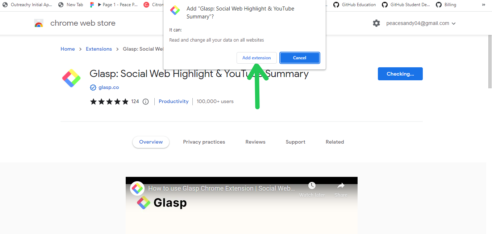

# Discover the Benefits of using Glasp, the social web highlighter for life long learners.

# Introduction
Glasp is an AI - powered summary for thought leaders, it is a personalized summary based on your highlights
and notes. GLASP - stands for "Greatest Legacy Accumulated as Shared Proff".

# An Overview of Glasp
Glasp is a highlighting app that can be used to read articles and take notes. It is also a social note-taking
tool. When a user visits [Glasp](Glasp.co), they can follow interesting people and see what they are reading, highlighting and taking notes about. Every highlight and note made on Glasp is public on the user's profile. Glasp works with a browser extensiom, so it's perfect for reading on your desktop or laptop. 

Glasp's   primary objective is to eliminate the isolation of knowledge, commonly referred to as the "Social web highlighter". The term "social" denotes that other individuals can view the information you've highlighted, enabling them to learn from it. Additionally, it's a web highlighter that allows you to quickly and efficiently highlight essential points while reading and transfer them to Glasp in a well-formatted manner.

# Getting Started with Glasp
  The steps below will guide you on how to sign up on Glasp
  1. Go to your web browser and type glasp.
  !()[openonyourbrowser.png]
  2. The official website will pop-up, click on it and navigate to creating your account.
  !()[signupbeta.png]
  3. Click the Glasp icon, then sign up via Google account.
  !()[continuewithgoogle.png]

  # How do i use Glasp
Glasp's navigation is straightforward and easy to follow. To highlight your information, you can simply click and drag as you would on a regular page. Then, select a color to use for highlighting. You can collect all the necessary information from the page you're reading at once, and process it later into your preferred note-taking software.

# Install Glasp Extension
To add the Glasp extension to Google Chrome, please follow the steps below:

1. Launch Google Chrome on your computer.
2. Navigate to the official website of [Glasp](glasp.co).

3. Locate and click on the "Install on Chrome" button.

4. Afterward, you will be redirected to the Chrome Web Store.
5. Next, click on the "Add to Chrome" button located at the top right corner of the page.
  A confirmation pop-up window will appear asking for permission to add the extension.
  
6. Click on "Add extension" to confirm.

7. Allow a few seconds for the installation to complete.
8. Upon completion, the Glasp icon will appear on the top right corner of your browser.
 Congratulations! You have now successfully installed the Glasp extension on Google Chrome.

# How to use Glasp with Obsidian
To use Glasp, you will require both Obsidian and the Glasp extension.

 * First Option

 To get started, highlight the relevant sentences and quotes that you wish to keep, and add any necessary notes.

Next, navigate to the Glasp homepage, select "My Highlights", and locate the article containing the quotes you wish to use. Then, click "Copy Content" in the top-right corner.

Finally, open Obsidian, create a new page, and paste the copied information into it.

* Second Option

Follow the same steps as described earlier, stopping before the "Copy Content" step. Instead, click the button next to it, followed by the purple MD icon beneath it. Save your note in the desired Obsidian folder, and it will appear in the app.

# Here are some of the features of Glasp
- Summarization

Glasp is an AI tool that creates text summaries of YouTube videos, displayed in a separate panel. Users can customize the summary's level of detail, choose from multiple languages, and see key phrases highlighted. The summary can be shared via email, social media, or messaging apps, or copied to a text editor.

- Customization

Users have the ability to customize the level of detail in the video summary by adjusting the summarization settings. This allows them to choose between a brief overview of the video or a more comprehensive summary that includes more information.

- Language Support

Glasp offers support for several languages, such as English, French, German, Italian, Portuguese, and Spanish.

- Highlighting

Glasp simplifies comprehension of the video's key points by highlighting significant phrases and sentences in the summary.

 # Reasons to use glasp
When using Glasp, you can seamlessly gather information without interrupting your reading flow. Unlike traditional methods where you have to stop, navigate to a different page, or refer to physical notes, Glasp allows you to collect all necessary information from a single page and process it later into your preferred note-taking software.

Moreover, Glasp serves as a social highlighting tool that enables you to connect with people searching for similar information and gain insights from their ideas. You can build upon their thoughts, discover what others find essential, and learn why.

Unlike other tools that merely store links for later reading, Glasp encourages active reading and note-taking. Its social aspect also fosters accountability, motivating you to follow through and read and process the information.

# Advantages of utilizing Glasp

* Highlighting with glasp helps us to actually read rather than scan through an article.

* Glasp helps Users to also quickly refer to important sections of an article

* Glasp is a very helpful tool, that allows Users keep easily accessible, the most important and interesting content we see.

* Glasp is important because it helps learners get recognized for finding amazing highlights and it helps them connect with others who are learning the same thing at the same time.

* Glasp has the best highlighting workflow, while reading an article, you can select test in order to highlight and annotate without having to go to a different page.

* All of your highlights for a specific article appear on a right side bar as you're reading, and they're easy to copy and paste into another note-taking app.

# Conclusion
Glasp is a really amazing tool, i highly recommend checking out Glasp if you like to read articles. Sign up and use it!